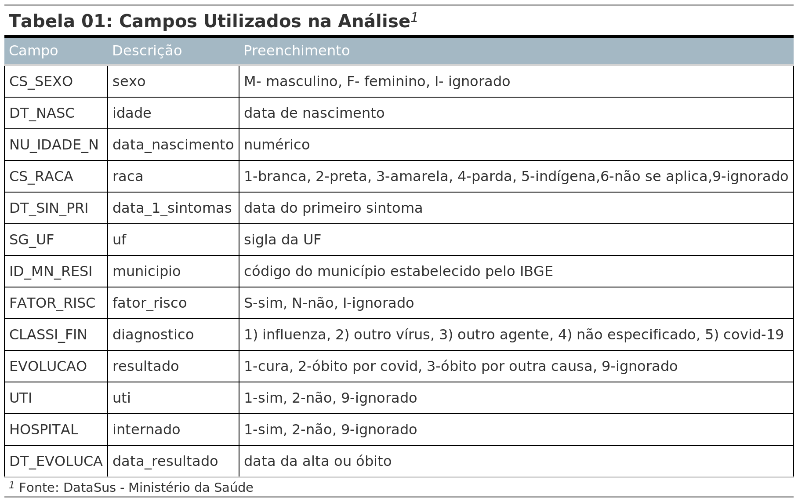
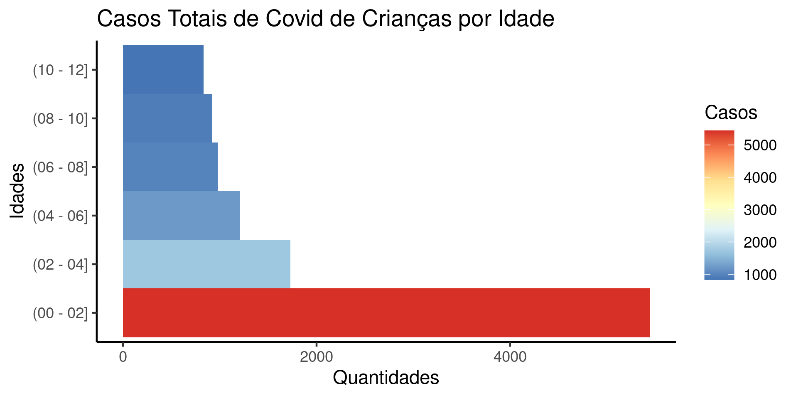
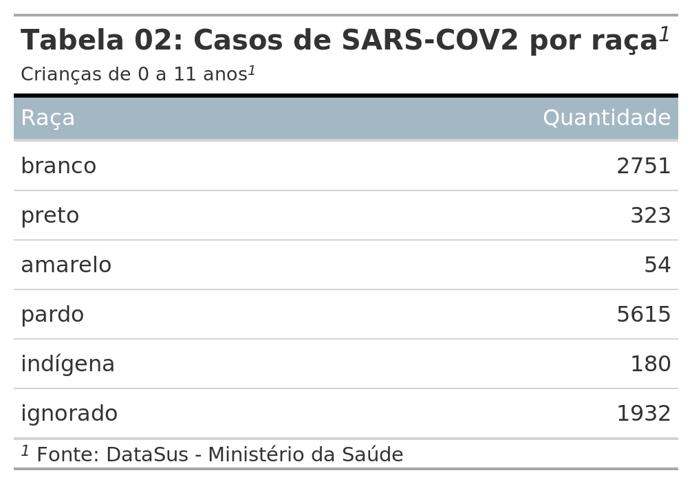
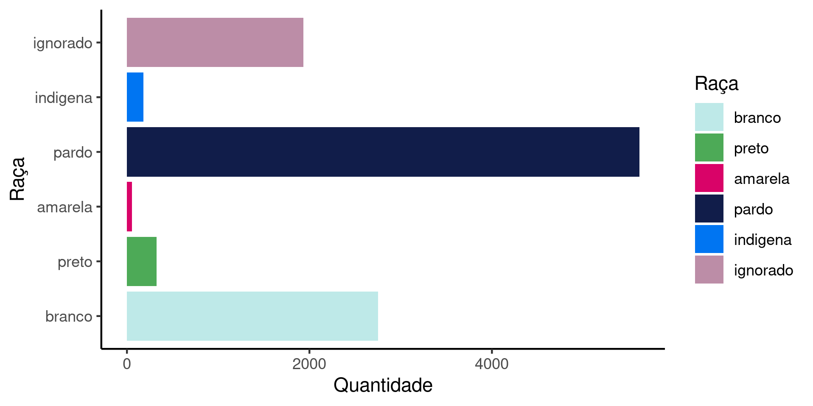
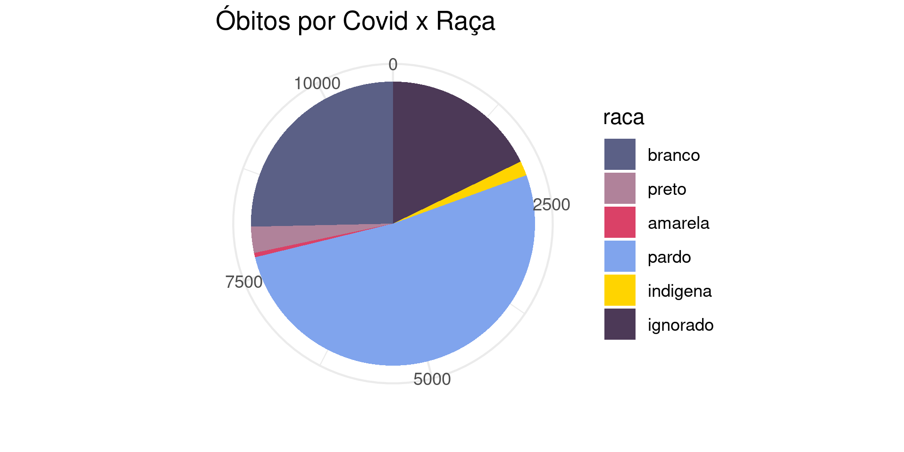
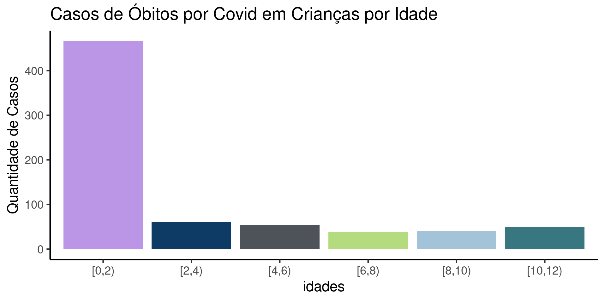

```{r setup, include=FALSE}
knitr::opts_chunk$set(echo = FALSE)
```

```{=tex}
\spacing{1.5} 
\setlength{\parindent}{1.5cm}
\setlength{\parskip}{0.1cm}
```
# Introdução

Este trabalho tem por objetivo utilizar os conceitos da linguagem R abordados no curso "Introdução à Linguagem R" das professoras Beatriz Milz, Nicole Luduvice e Amanda Amorim, do curso-R, em uma análise de base de dados.

Devido ao debate que ocorre na sociedade por meio das redes sociais e de comunicação sobre a importância da vacinação contra a COVID 19 em crianças, muitas dúvidas sobre sua eficácia, segurança e necessidade foram levantadas. A falta de informação tem levado pessoas a não aderirem ao programa nacional de imunização, deixando milhares de crianças sem a proteção que as vacinas podem proporcionar.

O estudo técnico elaborado pela Câmara Técnica de Assessoramento em Imunização da COVID-19 (CTAI-19), órgão do Ministério da Saúde, traz informações sobre os casos diagnosticados de Síndromes respiratórias Agudas (SRAG) por COVID-19 e sobre o número de óbitos em crianças entre 0 e 11 anos.

Segundo este estudo realizado sobre a base de dados do Sistema de Informação de Vigilância Epidemiológica da gripe (SIVEP-GRIPE), do Ministério da Saúde, desde o início da pandemia foram registrados 23.277 casos de SRAG por COVID-19 em crianças, sendo que 1.449 evoluíram para óbito[^1] **[@Covid19JaMatoua]**. De acordo com este estudo 17.114 casos ocorreram em crianças menores de 5 anos, dos quais 1.148 pereceram.

[^1]: <https://butantan.gov.br/noticias/covid-19-ja-matou-mais-de-1.400-criancas>

Pretende-se neste projeto repetir esta análise, porém com o Banco de Dados de Síndrome Respiratória Aguda Grave (SRAG 2020), que inclui os dados da COVID-19, do mesmo Ministério da Saúde[^2]**[@SRAG2020Banco]**, bem como realizar o cálculo da taxa de letalidade, número total de óbitos dividido pelo total de casos de pacientes com a doença, que evoluiram para óbito ou alta, de crianças entre 0 e 11 anos de idade.

[^2]: <https://opendatasus.saude.gov.br/dataset/srag-2020>

```{=tex}
\spacing{1.5} 
\setlength{\parindent}{1.5cm}
\setlength{\parskip}{0.1cm}
```
# Metodologia

Foi criado o projeto de trabalho e os arquivos organizados nos seguintes diretórios: ***scripts*** com os códigos, ***manuscrito*** com o arquivo "trabalho_curso_r.Rmd", ***imagens*** com a figuras geradas para o manuscrito, ***dados*** com os arquivos .csv e ***citações*** com os arquivos .csl e .bib.

A análise foi realizada por meio de dois scripts: o primeiro "importação_dados_covid_criancas.R" e o segundo "analise_dados_covid_criancas.R", aquele para a importação e seleção das variáveis e este para a preparação e análise dos dados.

Considerou-se 13 variáveis socioeconômicas e de internação dos pacientes, como a data de nascimento, idade, sexo, raça ou cor, escolaridade, município e estado, existência de fatores de risco, internação em UTI ou enfermaria e a evolução da doença, entre outras.

Estas variáveis foram selecionadas de acordo com o dicionário de dados da base de notificações de Sindrome Respiratória Aguda e descritos na tabela 01.

```{=tex}
\begin{center}
\vspace {0.7cm}
```
{width="446"}

```{=tex}
\vspace {0.7 cm}
\end{center}
\spacing{1.5} 
\setlength{\parindent}{1.5cm}
\setlength{\parskip}{0.1cm}
```
Os dados foram extraídos em 24 de fevereiro de 2022, com a última atualização realizada pelo Ministério da Saúde em 23 de fevereiro de 2022 (arquivo "INFLUD20-21-02-2022.csv"). Ressalta-se que a análise considerou apenas os campos das variáveis que não estavam vazios.

Nas análises sobre as características raça ou cor, utilizou-se as mesmas definições adotadas pelo Instituto Brasileiro de Geografia e Estatística (IBGE), cujos levantamentos de dados são obtidas por auto-atribuição, ou seja, branco, preto, amarelo, pardo, indígena e ignorado.

Durante a análise dos dados, verificou-se que as idades das crianças com menos de 1 ano foram informadas em meses ou dias de vida ao invés de anos como nos demais registros (outras crianças, jovens e adultos). Para resolver este problema de diferentes escalas, foi calculada a idade dos pacientes, conforme a definição estabelecida pelo dicionário dos dados , como a diferença entre a data do aparecimento dos primeiros sintomas e a data de nascimento. Para aqueles sem a informação da data de nascimento foi considerada a idade declarada pelo paciente.

O curso "Introdução à Linguagem R" não abordou os conteúdos sobre gráficos, por este motivo foi utilizada a função "esquisser" do pacote "esquisse", a qual fornece uma interface gráfica para o uso do pacote ggplot.

# Resultados

```{=tex}
\spacing{1.5} 
\setlength{\parindent}{1.5cm}
\setlength{\parskip}{0.1cm}
```
A importação dos dados resultou em 1.199.928 casos de SRAG e 153 variáveis. Destes registros, considerou-se apenas os resultados confirmados por COVID-19, totalizando 711.794 linhas.

A partir deste total, foram selecionados os dados de crianças de 0 a 11 anos, resultando em 11.114 casos no período de 2020 a fevereiro de 2022.

Entre estas crianças, o maior número de casos se concentrou na faixa etária de 0 a 1 ano, 5.442. Nas demais, de 2 a 3 anos, 1.728; 4 a 5 anos, 1.211; 6 a 7 anos, 980; 8 a 9 anos, 920 e de 10 a 11 anos, 833, como se pode obervar no gráfico.

```{=tex}
\begin{center}
\vspace {0.7cm}
```
{width="420"}

```{=tex}
\vspace {0.7 cm}
\end{center}
\spacing{1.5} 
\setlength{\parindent}{1.5cm}
\setlength{\parskip}{0.1cm}
```
A maioria entre pretos e/ou pardos, seguida pelos brancos, ignorados, indígenas e amarelos, nas quantidades por raça ou cor apresentadas na tabela 02.

```{=tex}
\begin{center}
\vspace {0.7cm}
```
|                                    |                                        |
|----------------------------------|:------------------------------------:|
| {width="222"} | {width="333"} |

```{=tex}
\vspace {0.0 cm}
\end{center}
\spacing{1.5} 
\setlength{\parindent}{1.5cm}
\setlength{\parskip}{0.1cm}
```
A taxa de letalidade entre 0 e 11 anos foi calculada pela relação entre o número de óbitos e o total de casos com desfecho, em que se considera os óbitos e as altas.

Não foi considerado o número de óbitos por "outras causas" e os dados com desfecho "ignorado".

```{=tex}
\begin{center}
\vspace {0.0 cm}
```
$$
Letalidade = \frac{NÚMERO \ DE \ ÓBITOS}{NÚMERO \ TOTAL \ DE \ CASOS \ COM \ DESFECHO}
$$

```{=tex}
\vspace {0.5 cm}
\end{center}
\spacing{1.5} 
\setlength{\parindent}{1.5cm}
\setlength{\parskip}{0.1cm}
```
O número de casos de crianças que evoluíram para óbito por causa da COVID-19 foi de 709 e a soma do total de doentes que vieram a óbito e os que obtiveram alta hospitalar foi de 664.193.

A relação entre óbitos e os casos com desfecho resultou em uma taxa de letalidade de 0,107%.

# Conclusão

A divergência entre o número obtido pela análise dos dados do SIVEP-GRIPE de 1.449 mortes e o obtido por esta análise, realizada sobre os dados de síndrome respiratória aguda (SRAG 2020), de 709 óbitos, deve-se em grande parte ao fato de que as notificações repassadas pelos estados à base do SRAG 2020 não representam o total de casos confirmados em todo território nacional.

Isto é evidenciado quando se compara o número total de crianças com SRAG por COVID-19 registrado no SIVEP-GRIPE de 23.277 casos com o número registrado no banco de dados do SRAG 2020 de 11.114.

A taxa de letalidade das crianças entre 0 e 11 anos calculada de 0,107% é um número baixo, entretanto em valores absolutos 709 mortes de crianças é valor muito alto.

Considerando as variáveis raça ou cor, o número de óbitos entre as crianças pretas e/ou pardas é significativamente maior que o das demais raças, conforme demonstrado no gráfico abaixo.

```{=tex}
\begin{center}
\vspace {1 cm}
```
{width="414"}

```{=tex}
\vspace {0 cm}
\end{center}
\spacing{1.5} 
\setlength{\parindent}{1.5cm}
\setlength{\parskip}{0.1cm}
```
Outra informação importante observada foi a maior incidência de mortes entre as crianças com menos de 2 anos de idade, totalizando 466 mortes entre os 709 casos de óbitos, o que representa 65,726% dos óbitos na faixa etária de 0 a 11 anos.

```{=tex}
\begin{center}
\vspace {1 cm}
```
{width="416"}

```{=tex}
\vspace {0 cm}
\end{center}
```
\newpage

## Referências

```{=tex}
\spacing{1.5} 
\setlength{\parindent}{1.5cm}
\setlength{\parskip}{0.1cm}
```
\singlespacing

::: {#refs}
:::
